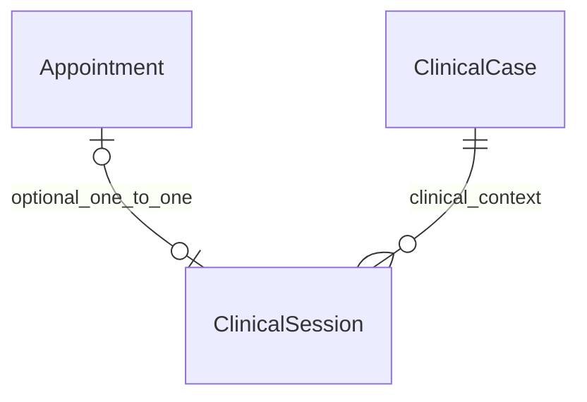
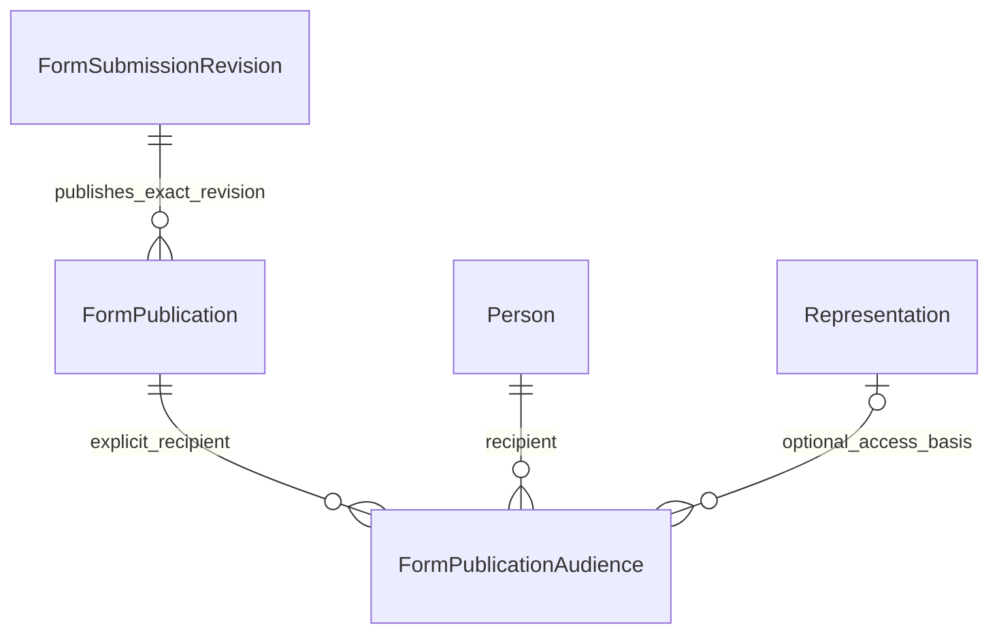

# جوما — الحاقیهٔ Logical ERD v0.2

مرجع: تأیید صریح کارفرما برای ورود به Physical Schema پس از بازبینی Logical ERD v0.1.
این الحاقیه سه مورد مصوب جدید را جایگزین موارد PROPOSED مربوط می‌کند. سایر موارد باز بدون پاسخ، خودکار مصوب نمی‌شوند.

## ۱. جلسه و نوبت — APPROVED

هر Appointment حداکثر یک ClinicalSession و هر ClinicalSession حداکثر یک Appointment دارد. جلسه بدون نوبت مجاز است، ولی Case و مسئول معتبر لازم دارد. این مجوز، رضایت/اختیار/شروط خدمت را حذف نمی‌کند.

در V1 چند جلسه برای یک نوبت و نوبت گروهی هم‌زمان چند Case مستقل خارج است. زوج/خانواده با چند شرکت‌کننده در همان Case و جلسه مصوب همچنان پشتیبانی می‌شود؛ «حذف خدمات» از این محدودیت نتیجه نمی‌شود.

اعمال فیزیکی: appointment_id nullable + UNIQUE و FK مرکب به case/therapist نوبت. FK مستقل Case/Clinician حتی در حالت بدون نوبت برقرار است.

## ۲. مخاطب پاسخ فرم — APPROVED

الگوی PublicationAudience مشترک است، ولی grantها برای منابع مختلف FK تایپ‌شده دارند؛ جدول فرم و گزارش مستقل‌اند. عضویت Case مجوز پاسخ شخص دیگر نیست.

Draft فقط برای ثبت‌کننده مجاز همان پاسخ و درمانگر مسئولِ دارای اختیار معتبر قابل مشاهده است؛ نقش بالینی عمومی یا ثبت داده خارج از اختیار، حق مشاهده ایجاد نمی‌کند. استثنای نویسنده‌محور PrivateNote و ممنوعیت پورتال خام تست باقی است.

Publication برای نسخه SUBMITTED/CORRECTION مجازِ قابل اشتراک با recipient صریح ایجاد می‌شود؛ برنامه باید status نسخه و مجوز ناشر را کنترل کند. FK به‌تنهایی این شروط را ثابت نمی‌کند. در نمودار فرزندان Audience صفر یا چند نشان داده شده‌اند چون ساختار DB حداقل یک فرزند را تضمین نمی‌کند؛ فرمان انتشار پورتال باید مخاطب معتبر را همراه ثبت انتشار قطعی کند.

فقط پذیرش الگوی grant مصوب است؛ این تأیید به معنی مجوز جدید برای ادمین ساختار یا رفع تعلیق نماینده نیست. دسترسی مبتنی بر نمایندگی در هر مشاهده دوباره بررسی می‌شود.

## ۳. راهبرد شناسه — APPROVED، انتخاب اجرایی UUIDv4

گزینه مصوب کارفرما شناسه پایدار غیرقابل حدس برای جداول اصلی و عدد برای Lookup است. برای DDL v0.1، UUIDv4 با ذخیره BINARY(16) انتخاب شده؛ Lookupها INT UNSIGNED AUTO_INCREMENT دارند.

UUID تصادفی ابزار کاهش حدس‌زدن شناسه است، نه مجوز. کنترل رابطه/Scope/مخاطب و I-08 همچنان لازم‌اند. ULID/UUID زمان‌محور به‌جای UUIDv4 بی‌تصویب استفاده نمی‌شوند.

## ۴. مواردی که این رأی نمی‌بندد

- قرارداد crypto/recovery/metadata یادداشت خصوصی؛ هیچ payload آشکار جایگزین نشده است.
- جزئیات دفترکل، کیف‌پول، سهم، واحد پول و پرداخت سازمانی.
- عمر مجوز آزمون‌گر، رفع تعلیق، اعلان ایمن و اثر تغییر تنظیمات بر تعهد جاری.
- عامل/مهلت دقیق NO_SHOW و اصلاح دیرهنگام.
- نسخه واقعی PHP/MySQL هاست و موفقیت اجرای DDL.

ارجاع جاری: JOMA-PHYSICAL-SCHEMA-v0.1-FA.md و database/joma-v0.1/001_core.sql. این فایل اصلاح منطقی مصوبات است، نه ادعای اجرای موفق schema.
