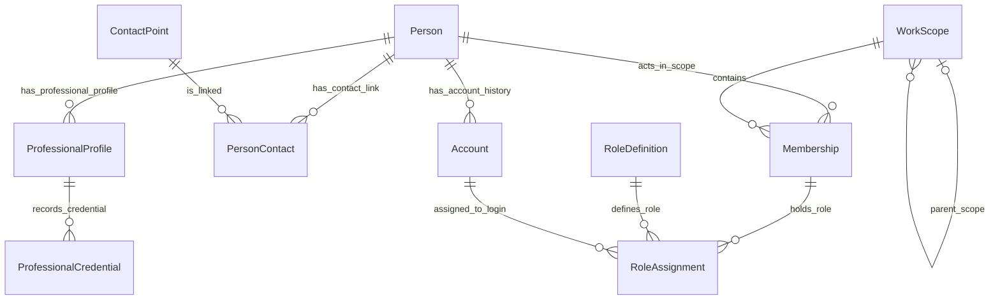
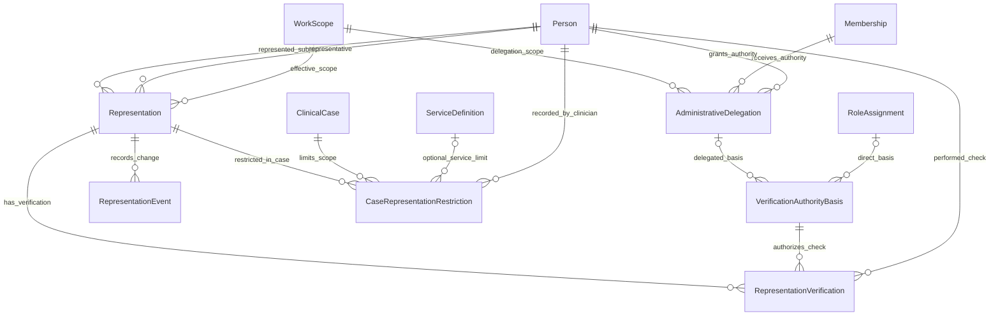
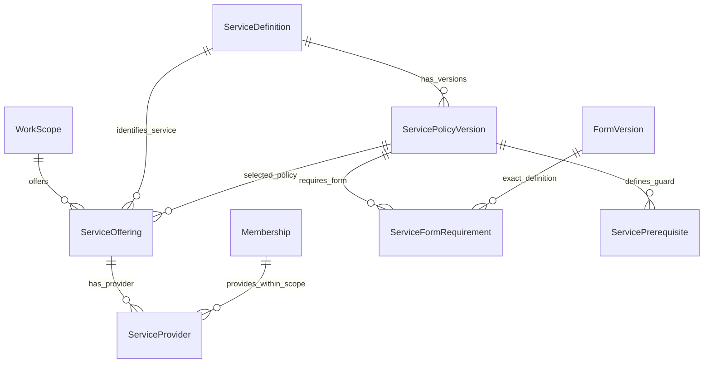
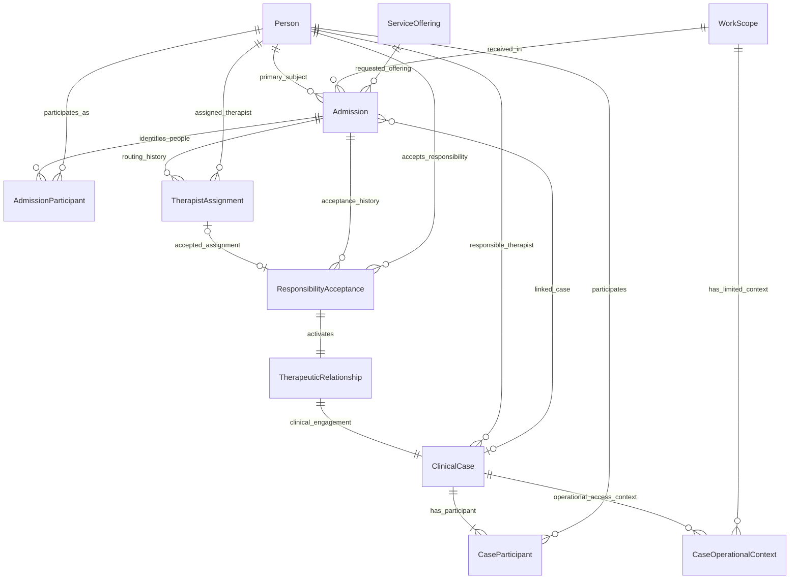
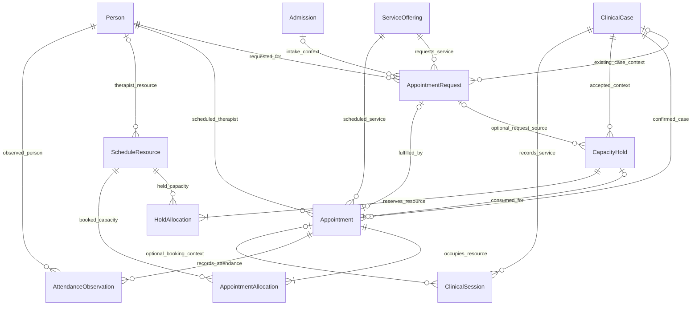
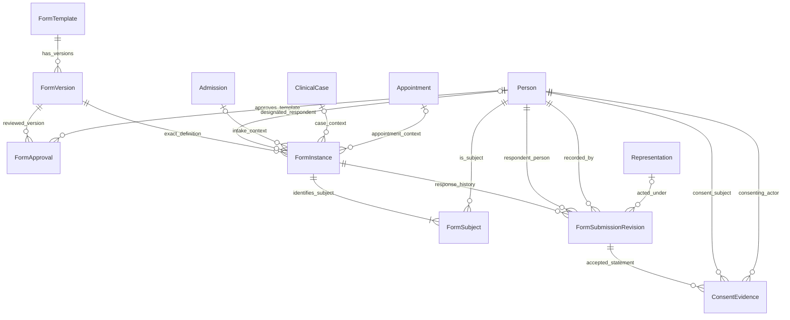
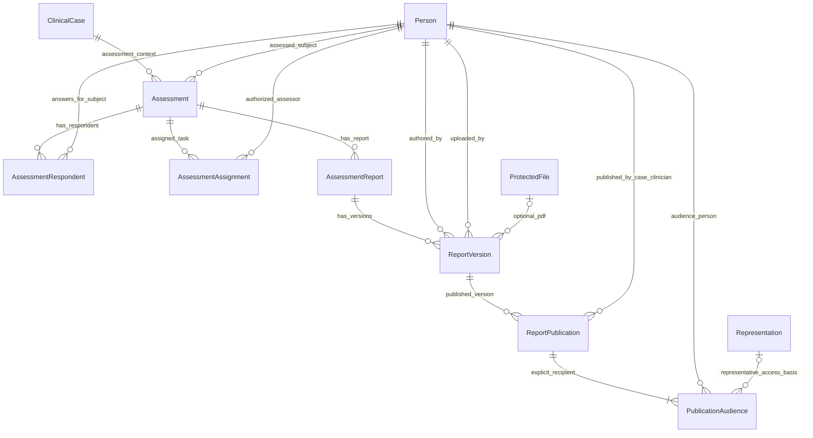
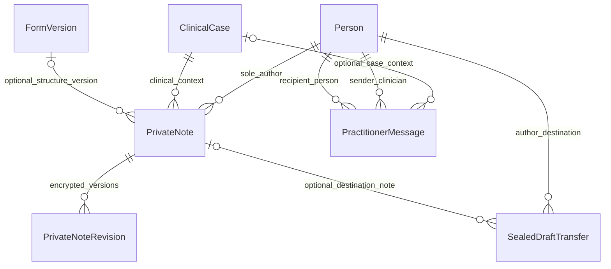
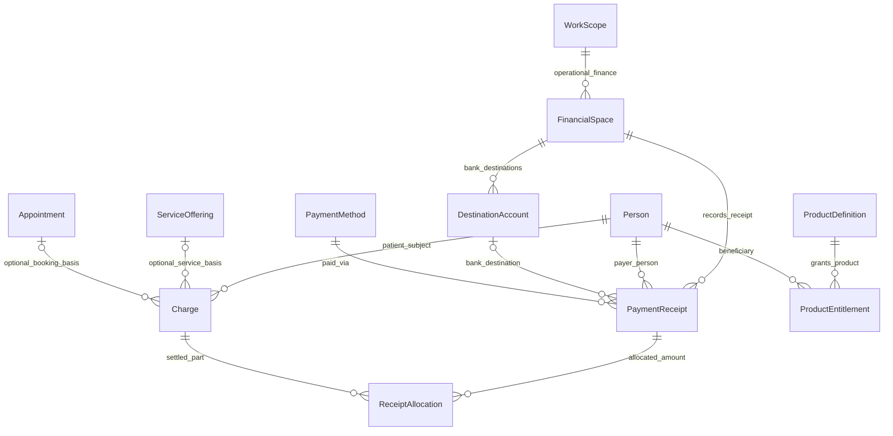

# جوما — Logical ERD v0.1

**وضعیت:** طرح منطقی برای بازبینی؛ نه Schema فیزیکی، SQL، Migration یا قابلیت اجراشده.
**تاریخ:** ۲۰۲۶-۰۹-۲۴
**مراجع:** واژه‌نامه v1.0، Decision Register v0.6، Authority & Governance v0.2، Service Policy v0.1 و Domain Model & Consistency Boundaries v0.1؛ به‌اضافهٔ تأیید صریح اخیر کارفرما درباره پشته، ClinicalEngagement و جدایی نقش اشخاص.

## ۱. تصمیم‌های مبنا و نحوه خواندن

- پشته نسخه اول قطعی است: PHP سبک ماژولار/تابع‌محور، MySQL با InnoDB و mysqli روی هاست استاندارد؛ PostgreSQL/JSONB، PDO، ORM و سرویس دائمی اجباری وارد طرح نمی‌شوند.
- ساختار فرم و پاسخ‌های مناسب آن در طراحی فیزیکی می‌توانند از JSON استاندارد MySQL استفاده کنند. در این ERD نوع فیزیکی ستون، SQL و ایندکس نهایی انتخاب نمی‌شود. نسخه و قابلیت‌های واقعی PHP/MySQL میزبان باید پیش از Migration بررسی شوند؛ وجود JSON یا هم‌ارزی MariaDB فرض عملیاتیِ آزموده‌شده نیست.
- ClinicalEngagement مرز سازگاری مصوبِ TherapeuticRelationship + ClinicalCase است، نه جدول سوم لازم و نه الزام class. ثبت/پایان هماهنگ این دو با پذیرش/رویداد مربوط، تراکنش اتمیک محلی می‌خواهد.
- Subject، Respondent، Author، Representative و Payer نقش‌های معنایی مستقل با ارجاع جدا به Person هستند؛ قرار نیست برای هر نقش هویت شخصی تازه بسازیم.
- Admission، AppointmentRequest و فرم پیش‌پرونده می‌توانند Case نداشته باشند. نبود Case با رکورد ساختگی جبران نمی‌شود.
- موارد باز با OPEN و پیشنهاد مهندسی با PROPOSED مشخص‌اند. ترسیم ساختار لازم برای یک واقعیت، مجوز اجرای انتقالِ حل‌نشده نیست.

### راهنمای نمودارها

نام‌ها شناسه منطقی‌اند، نه نام نهایی جداول. `||` دقیقاً یک؛ `o|` صفر یا یک؛ `o{` صفر یا چند؛ `|{` یک یا چند. برچسب رابطه، معنا را بیان می‌کند. محدودیت‌هایی مثل «حداکثر یک حساب فعال» یا «عدم تداخل بازه زمان» با کاردینالیتی ساده نشان داده نمی‌شوند و در بخش یکپارچگی آمده‌اند.

نمودارها حوزه‌ای‌اند و موجودیت مشترک مثل Person یا ClinicalCase برای خوانایی تکرار شده، نه اینکه چند جدول هم‌نام پیشنهاد شود. فهرست صفات حداقل معنایی است، نه همه ستون‌ها؛ اطلاعات حساس نمونه وارد سند نشده است.

## ۲. هویت، فضای کاری و نقش

| موجودیت | صفات/ارجاع‌های منطقی کلیدی | محدودیت |
|---|---|---|
| Person | شناسه پایدار، مشخصات هویتی لازم | مستقل از تلفن، نقش و Account؛ کودک نیز Person مستقل |
| Account | person، وضعیت، اطلاعات ورود | در هر نصب حداکثر یک Account فعال برای هر Person؛ تاریخچه حساب غیرفعال در صورت نیاز محفوظ |
| ContactPoint | نوع و مقدار تماس | ممکن است مشترک باشد؛ به‌تنهایی اثبات هویت/نمایندگی نیست |
| PersonContact | person، contact، نوع ارتباط/اعتبار | تماس نماینده با تماس خود موضوع یکی نشود |
| WorkScope | نوع فضای مستقل/مرکز/شعبه، والد اختیاری، وضعیت | مستقل نیازمند مرکز صوری نیست؛ عضویت والد مجوز همه فرزندان نمی‌سازد |
| Membership | person، scope، اعتبار/وضعیت | عضویت یک فضا، حق فضای دیگر نیست |
| RoleAssignment | account، membership، role، اعتبار | Person حساب و عضویت باید یکسان باشند؛ نقش فعال در فرمان معلوم باشد |
| ProfessionalProfile / Credential | person، نوع حرفه، صلاحیت/مجوز و اعتبار | عنوان عمومی درمانگر؛ نقش نرم‌افزاری اثبات صلاحیت حرفه‌ای نیست |

Account به RoleAssignment وصل است تا زمینه ورود مشخص باشد، ولی نویسنده/موضوع اسناد به Person ارجاع دارند تا تاریخچه با تغییر حساب از بین نرود. مدارک حرفه‌ای و حداقل داده هویتی در مراحل بعد پالایش می‌شوند؛ هیچ قانون سنی/حقوقی جدیدی از این جدول استخراج نمی‌شود.

## ۳. نمایندگی، تفویض و تعلیق محدود

| موجودیت | صفات/ارجاع‌ها | معنا |
|---|---|---|
| Representation | representative_person، subject_person، scope، مبنا/دامنه عمل، اعتبار، وضعیت | اعتبار سامانه برای اعمال معین؛ نه حکم حقوقی عمومی |
| AdministrativeDelegation | grantor_person و زمینه اختیار، grantee_membership، scope، اعمال مجاز، شروع/پایان اختیاری، وضعیت | مستمر یا موردی؛ دامنه موردی می‌تواند به پذیرش/نمایندگی مشخص اشاره کند و Case الزامی نیست |
| VerificationAuthorityBasis | نوع اختیار مستقیم/تفویض‌شده، role_assignment یا delegation، دامنه و اعتبار | دقیقاً یکی از دو مبنا؛ مفهوم تایپ‌شده است، نه الزام جدول واسط نهایی |
| RepresentationVerification | representation، authority_basis، actor_person، زمان، نوع شاهد/مدرک، نسخه سیاست، نتیجه اداری | منشی با تفویض معتبر؛ صاحب اختیار مستقیم با نقش اداری معتبر؛ حداقل داده لازم |
| RepresentationEvent | representation، نوع رخداد، actor، authority، scope، زمان/دلیل لازم | لغو/تغییر معتبر، حفظ تاریخچه؛ مبنای ممیزی عمومی را تکمیل می‌کند |
| CaseRepresentationRestriction | representation، case، service اختیاری، clinician، زمان، وضعیت محدودیت، مرجع دلیل حفاظت‌شده | تعلیق فوری در Case؛ نه PAUSED رابطه و نه لغو مرکز |

**مبنای اختیار تایپ‌شده:** Verification همیشه شاهد اختیار دارد؛ در مسیر منشی، AdministrativeDelegation معتبر و در مسیر صاحب اختیار مستقیم، RoleAssignment اداری معتبر در همان Scope. VerificationAuthorityBasis یک انتخاب انحصاری منطقی است: دقیقاً یکی از دو ارجاع، نه هر دو و نه هیچ‌کدام. Actor بررسی باید با دارنده اختیار مربوط سازگار باشد. این روش بدون «تفویض به خود» یا منشی صوری، مسیر مصوب درمانگر مستقل را پوشش می‌دهد. نحوه فیزیکی نمایش این انتخاب در مرحله بعد تعیین می‌شود؛ معنای اختیار مستقیم از نقش عمومی درمانگر به‌تنهایی استخراج نمی‌شود.

حدود موردی Delegation باید با ارجاع‌های کنترل‌شده به منبع مجاز مدل شوند؛ فیلد آزاد `resource_type/resource_id` مجوز دلخواه یا یکپارچگی اثبات‌شده ایجاد نمی‌کند. راه فیزیکی constraint بعداً تعیین می‌شود.

لغو Delegation، Representationهای بررسی‌شده را خودکار باطل نمی‌کند. تعلیق Case باید در کنار هر مجوز سند وابسته به همان نماینده بررسی شود. رفع تعلیق/بازاعطای نمایندگی **OPEN** است؛ وجود وضعیت یا رویداد به معنی مجازبودن فرمان بازگردانی نیست.

## ۴. خدمات، سیاست نسخه‌دار و فرم‌های لازم

| موجودیت | صفات/ارجاع‌ها | قاعده |
|---|---|---|
| ServiceDefinition | شناسه و عنوان خدمت، وضعیت تعریف | همه انواع خدمات در دامنه V1؛ عنوان خدمت به‌تنهایی مرز Case نیست |
| ServicePolicyVersion | service، نسخه، زمان اثر، وضعیت، قواعد نقش/شرکت‌کننده/خدمت | معنای قاعده قابل آزمون؛ کد/فرمول دلخواه اجرا نمی‌شود |
| ServiceOffering | scope، service، policy_version، مدت/ظرفیت عملیاتی و وضعیت عرضه | نسخه سیاست متعلق به همان خدمت؛ تقدم سیاست مرکز/شعبه هنوز جزئیات OPEN دارد |
| ServiceProvider | offering، membership، اعتبار | عضویت/صلاحیت و اختیار عرضه جدا بررسی شوند |
| ServiceFormRequirement | policy_version، form_version، مرحله، تکمیل‌کننده مجاز، الزام | نسخه صریح؛ انتشار قالب مساوی تکمیل فرم نیست |
| ServicePrerequisite | policy_version، نوع شرط، عمل هدف، نوع شاهد و مرجع تأیید | وضعیت پرداخت/رضایت از منبع معتبر؛ شرط ناشناخته ALLOW نشود |

پیش‌نیازها تعریف‌اند، نه کپی وضعیت مالی/رضایت در JSON بدون مرجع. منبع شاهد شرط می‌تواند ConsentEvidence یا تأیید مالی معتبر باشد؛ نوع‌های مجاز و قرارداد بررسی قبل از طراحی فیزیکی دقیق می‌شوند. جدول عمومی «همه شرط‌ها true» جای کنترل اختیار/صلاحیت/تعلیق را نمی‌گیرد.

## ۵. پذیرش، مسئولیت، رابطه و پرونده

| موجودیت | صفات/ارجاع‌ها | قاعده |
|---|---|---|
| Admission | primary_subject، offering، received_scope، actor، status، case اختیاری | پرونده هنگام پذیرش nullable؛ شخص بی‌حساب مجاز |
| AdmissionParticipant | admission، person، نقش و زمینه | نماینده/همراه با بیمار یا شرکت‌کننده بالینی یکی نیست |
| TherapistAssignment | admission، therapist_person، actor، وضعیت و تاریخچه | یک ارجاع باز در هر پذیرش/زمینه؛ تعیین درمانگر پذیرش نیست |
| ResponsibilityAcceptance | admission، therapist_person، assignment اختیاری، actor/account/context، زمان، شناسه فرمان | شاهد صریح پذیرش؛ مسیر مستقل می‌تواند بدون Assignment کارکنان باشد |
| TherapeuticRelationship | acceptance، وضعیت ACTIVE/ENDED، زمینه | رابطه در این مدل V1 با یک Case در همان زمینه هماهنگ است |
| ClinicalCase | relationship یکتا، responsible_therapist، هدف/زمینه، وضعیت ACTIVE/CLOSED | دقیقاً یک مسئول؛ مسئول باید با پذیرش معتبر سازگار باشد |
| CaseParticipant | case، person، نقش بالینی/اعتبار حضور | شرکت‌کننده ≠ مخاطب تمام اسناد؛ والد به‌خودی‌خود Participant بالینی نیست |
| CaseOperationalContext | case، scope، مبنای اجرایی، اعتبار | پیوند فعالیت/مجوز اجرایی؛ نه مالکیت کلینیک بر تمام سابقه و نه مجوز PrivateNote |

**کاردینالیتی پیشنهادی V1:** هر پذیرش معتبرِ مسئولیت برای آغاز زمینه تازه، یک Relationship و یک Case هماهنگ ایجاد می‌کند. Case فعال ممکن است چند Admission اجرایی مرتبط در تاریخچه داشته باشد؛ اتصال مجدد به Case موجود مجوز ساخت Acceptance جدید برای آغاز رابطه همان Case نیست. پاسخ‌گویی دقیق مسیر پذیرش مجدد پس از فاصلهٔ یک‌ساله و همان رابطه فعال همچنان OPEN است و نباید با ساخت خودکار Case حل شود.

ارجاع ردشده/لغوشده Acceptance ندارد؛ Acceptance مستقل لزوماً Assignment ندارد. هیچ Case فعالِ بدون شاهد پذیرش ساخته نمی‌شود. نوبت جدیدِ Case فعال نیازمند Admission/Acceptance آغازین تازه نیست.

CaseOperationalContext از جهت نیاز به حفظ تاریخچه درمانگر و تغییر محل لازم است؛ جزئیات اعطا/خاتمه اختیار عملیاتی مرکز، **PROPOSED** است. حضور یک scope در این رابطه به‌تنهایی مجوز خواندن همه اسناد نیست. سازمان سابق فقط با باقی‌ماندن یک پیوند تاریخی صاحب اختیار جاری نمی‌شود.

## ۶. درخواست، ظرفیت، نوبت و جلسه

| موجودیت | صفات/ارجاع‌ها | قاعده |
|---|---|---|
| AppointmentRequest | subject، offering، case اختیاری، admission اختیاری، ترجیح/پاسخ، fulfilled_appointment اختیاری | درخواست پیش‌پرونده مجاز؛ اگر هر دو زمینه هست سازگار باشند |
| CapacityHold | case، offering/نسخه سیاست، request اختیاری، actor، آغاز/انقضا، وضعیت | فقط پس از پذیرش و انتخاب معتبر؛ سقف اولیه ۱۵ دقیقه؛ تمدید خودکار مصوب نیست |
| ScheduleResource | نوع منبع، scope، ظرفیت/دسترس‌پذیری | درمانگر/اتاق یا منبع واقعی؛ جزئیات ظرفیت گروهی OPEN است |
| HoldAllocation | hold، resource، بازه/مقدار ظرفیت | Hold معتبر موقتاً اشغال می‌کند؛ مصرف/انقضا دوباره ظرفیت نسازد |
| Appointment | case، offering، therapist، بازه، scope/location، origin، وضعیت، سابقه تغییر | CONFIRMED بعد از پذیرش؛ STAFF_MANUAL استثنای دورزدن نیست |
| AppointmentAllocation | appointment، resource، بازه/ظرفیت | انتقال Hold به رزرو قطعی باید هماهنگ باشد؛ هر دو به‌طور مضاعف ظرفیت نشمارند |
| AttendanceObservation | appointment، person، recorder، زمان، نوع/شاهد حضور | CHECKED_IN انجام خدمت نیست؛ دلیل حساس در لاگ عمومی نیست |
| ClinicalSession | case، appointment اختیاری، درمانگر ثبت‌کننده، زمان/زمینه خدمت | وجود Session و ارتباط با Appointment **PROPOSED**؛ نحوه ثبت جلسه بدون نوبت و تعداد Session در یک Appointment هنوز OPEN |

در این مدل، نوبت قطعی Case دارد چون بعد از پذیرش اولیه، Case فوراً ساخته می‌شود. چیزی که پیش از پذیرش ثبت می‌شود AppointmentRequest/ترجیح است؛ برای STAFF_MANUAL پیشاپذیرش نیز Case یا CONFIRMED صوری ساخته نمی‌شود. اگر بعدها نوبت اجرایی غیر‌بالینی بدون Case لازم شود، باید به‌صراحت دامنه جدا تعریف شود؛ این ERD آن را حدس نمی‌زند.

حلقهٔ Admission/Request ممکن است برای مراجع بازگشتی کوتاه شود؛ حداقل زمینه معتبر باید وجود داشته باشد. پیشنهاد یکپارچگی: درخواست به Admission یا Case معتبر متصل باشد؛ اگر هر دو هست، پیوند و شرکت‌کنندگان سازگار باشند. این پیشنهاد باید با مسیر درخواست اولیه/مستقیم تأیید شود.

ClinicalSession در نمودار به‌طور موقت چند نمونه برای یک Appointment را قابل نمایش می‌گذارد؛ این **مجوز چند جلسه یا خدمت گروهی نیست**. کاردینالیتی دقیق و وجود Session بدون نوبت، قبل از Schema نهایی تعیین یا این بخش از ERD قطعی کنار گذاشته می‌شود. هیچ Session صرفاً با رسیدن ساعت یا NO_SHOW ساخته نمی‌شود.

بازرزرو نوبت لغوشده، Appointment تازه با پیوند تایپ‌شده به قبلی دارد؛ نوبت قبلی CANCELLED می‌ماند. جابه‌جایی نوبتِ لغونشده همان هویت با رویداد قبل/بعد است. هر دو مستقل از دریافت/استرداد وجه‌اند.

## ۷. قالب، نسخه، پاسخ و رضایت

| موجودیت | صفات/ارجاع‌ها | قواعد |
|---|---|---|
| FormTemplate | هویت قالب، نوع/طبقه منبع، scope | ساختار از داده واقعی جداست |
| FormVersion | template، شماره نسخه، تعریف JSON منطقی، وضعیت، مؤلف، زمان | نسخه منتشرشده ثابت؛ شناسه فیلد معنای تاریخی را حفظ کند |
| FormApproval | version، approver، authority/scope، تصمیم/زمان | تأیید نسخه، حق Submission نیست؛ تغییر محتوای نسخه تأیید قبلی را حمل نمی‌کند |
| FormInstance | form_version، respondent موردنظر اختیاری، زمینه‌ها، وضعیت تکمیل | پیش‌پرونده Case ندارد؛ حداقل زمینه مجاز و سازگاری ارجاع‌ها لازم |
| FormSubject | instance، subject_person، نقش موضوع | یک یا چند موضوع برای فرم مشترک؛ عضویت این رابطه مجوز مشاهده نیست |
| FormSubmissionRevision | instance، revision، respondent، recorded_by، representation اختیاری، پاسخ JSON، نوع ثبت/اصلاح | پاسخ‌دهنده و کسی که پاسخ را در سیستم وارد کرده می‌توانند متفاوت باشند؛ اصلاح قطعی سابقه قبلی را حذف نمی‌کند |
| ConsentEvidence | submission_revision، subject، consenting_actor، representation/شاهد اختیار در صورت کاربرد، متن/نسخه/زمان | رضایت برای متن مشخص؛ checkbox اثبات هر نوع امضای حقوقی نیست |

JSON برای تعریف فیلد و پاسخ مناسب است، نه برای پنهان‌کردن Person/Case/Audience/Authority/نسخه و روابط کلیدی. این ارجاع‌ها بیرون پاسخ JSON، قابل کنترل و ممیزی‌اند. نوع و محدودیت پاسخ باید با همان نسخه فرم در سرور بررسی شود؛ JSON معتبر الزاماً پاسخ معتبر یا بی‌خطر نیست.

پاسخ‌های **PrivateNote در این مخزن عمومیِ متن آشکار قرار نمی‌گیرند**. قالب خصوصی می‌تواند نسخه ساختار داشته باشد، اما داده خصوصی به حوزه مخزن رمز‌شده نویسنده می‌رود. خام آزمون نیز با فرم عمومی یا حق خودکار Subject/Respondent به مراجع منتشر نمی‌شود.

پیش‌نویس/ارسال/اصلاح معناهای متفاوت دارند؛ ذخیره خودکار پیش‌نویس، رضایت نهایی نیست. قرارداد دقیق snapshot پیش‌نویس، توقف نسخه معیوب و اعتبار رضایت قدیمی در تغییر سیاست **OPEN** است؛ نمودار روش نگهداری ابدی هر ضربه کلید را تجویز نمی‌کند.

## ۸. ارزیابی، گزارش، مخاطب و فایل

| موجودیت | صفات/ارجاع‌ها | مرز |
|---|---|---|
| Assessment | case، subject، نوع/نسخه ابزار در صورت موجود، زمینه/وضعیت | اجرای خودکار موتور ابزار الزامی روز اول نیست؛ خام پاسخ و تفسیر جدا |
| AssessmentRespondent | assessment، respondent_person، نسبت/زمینه مجاز | پاسخ والد برای کودک، Subject را عوض نمی‌کند |
| AssessmentAssignment | assessment، assessor_person، scope/اعتبار/داده مجاز | اختیار محدود ارزیابی/گزارش؛ نه عضویت بالینی عمومی Case |
| AssessmentReport | assessment، هویت پایدار گزارش | گزارش دستی متن/PDF از خام پروتکل جدا |
| ReportVersion | report، author، uploader، متن یا protected_file، وضعیت/نسخه | بارگذار لزوماً نویسنده نیست؛ فایل تازه انتشار قبلی را به ارث نمی‌برد |
| ProtectedFile | شناسه/مکان حفاظت‌شده، نوع، اندازه/اثر انگشت، وضعیت دریافت | لینک عمومی و فایل اجرایی نیست؛ اتصال نسخه پس از دریافت پایدار |
| ReportPublication | report_version، publisher، زمان، کانال/دامنه | publisher مسئول همان Case؛ پورتال و تحویل حضوری مستقل |
| PublicationAudience | publication، recipient_person، مبنای حق، representation اختیاری | مخاطب صریح؛ عضو آینده Case خودکار افزوده نمی‌شود؛ تعلیق جاری دوباره بررسی شود |

الگوی مخاطب برای سایر **اسناد قابل اشتراک** نیز لازم است، اما این ERD یک جدول عمومی شامل PrivateNote و مجوز همه منابع معرفی نمی‌کند. در صورت ایجاد هویت پایه SharedClinicalDocument در مرحله بعد، فقط انواع قابل اشتراک زیر آن می‌روند و مجوزهای هر نوع باقی می‌مانند. مخاطب فرم فردی زوج نیز از همین اصل پیروی می‌کند؛ جدول اختصاصی مجوز Submission/Report را نباید با FK به نوع دلخواه جایگزین کرد.

**OPEN:** سیاست قطعی grantهای پاسخ فرم و سایر اسناد باید قبل از کامل‌شدن ERD دسترسی آنها تعریف شود. نبود جدول/مجوز برای یک نوع، ALLOW نیست. نمودار ReportPublication مسیر معلوم گزارش را کامل‌تر نشان می‌دهد و ادعای پوشش نهایی تمام انواع سند ندارد.

دسترسی آزمون‌گر به پیش‌نویس از AssessmentAssignment معتبر و گزارش همان ارزیابی می‌آید، نه Audience مراجع. مقدار دقیق عمر مجوز و دسترسی پس از پایان مأموریت باز است؛ پیش‌فرض نامحدود ساخته نمی‌شود. طرح خام پاسخ/نمره موتور آزمون جزئیات بسته نهایی می‌خواهد و فعلاً به‌عنوان خروجی فرم‌ساز آزاد ساخته نمی‌شود.

## ۹. یادداشت خصوصی و پیام — حوزه‌های جدا

PrivateNote/Revision نام‌های منطقی‌اند؛ به معنی ذخیره همه متن‌ها یا نسخه‌ها در MySQL نیستند. در حالت Windows-local، داده در مخزن محلی رمز‌شده نویسنده است و حضور هر metadata مرکزی فقط در حد لازم و با دسترسی مجاز تعیین می‌شود. در حالت سروری، محتوای خصوصی ciphertext با رمزنگاری سمت کاربر است. فایل محلی و ciphertext، مسیر blob گزارش قابل اشتراک نیستند.

SealedDraftTransfer پیش‌نویس بسته‌شده از هر دستگاه پشتیبانی‌شده را منتقل می‌کند؛ دستگاه فاقد کلید فقط نوشتن/ارسال لازم دارد. حذف مبدأ پس از تأیید پایدار مقصد؛ جزئیات کلید، بازیابی، انقضا و محل نگهداری metadata **OPEN** هستند. این حوزه تراکنش اتمیک MySQL برای کل مسیر دستگاه–سرور–مخزن ندارد و به بازیابی تکرارپذیر نیاز دارد.

PractitionerMessage ارتباط یک‌طرفه و حوزه جداست؛ سازوکار حفاظت اولیه آن با رمزنگاری یادداشت خصوصی یکسان فرض نشده است. انتقال/export داخلی خودکار پیام به Case دیگر نداریم. ادعای جلوگیری قطعی از screenshot یا ممیزی تمام خواندن‌های آفلاین وجود ندارد.

## ۱۰. مالی و استحقاق — هستهٔ معلوم و بخش‌های باز

PaymentReceipt واقعه دریافت با پرداخت‌کننده مشخص و FinancialSpace معلوم است؛ در دریافت بانکی DestinationAccount الزامی و متعلق به همان فضای مالی مجاز است. Contact یا Patient به‌طور خودکار Payer نمی‌شود. Provider/Payee و Patient/Subject مفاهیم مستقل‌اند؛ تعیین رابطه قراردادی آن‌ها با Charge قبل از Schema مالی لازم است.

**PROPOSED / جزئی:** Charge و ReceiptAllocation برای جلوگیری از یکی‌گرفتن مبلغ خدمت، پرداخت و تسویه پیشنهاد شده‌اند. تخصیص جزئی/چندگانه، صورتحساب، نقد، پرداخت سازمانی، سهم درمانگر، بستانکاری و دفترکل کامل هنوز مصوب تفصیلی نیستند. نمودار این قسمت نباید به‌عنوان مجوز ماژول کیف‌پول یا مالی خودکار پیاده‌سازی شود. تعیین کف دامنه مالی و طرف سازمانی پیش از ERD نهایی مالی ضروری است.

ProductEntitlement مربوط به محصول و ذی‌نفع مشخص است؛ شاهد خرید/تأیید معتبر می‌خواهد، ولی پیوند به پرداخت کلینیک به‌عنوان شاهد خودکار فرض نشده است. رابطه دقیق خرید موتور تست با دریافت کلینیک پس از بسته نهایی تعیین می‌شود. دسترسی خروجی پولی به انتشار و Audience نیز وابسته است؛ درمانگر معالج برای دیدن خروجی تولیدشده نیازمند خرید مراجع نیست.

دریافت، Revenue و PractitionerShare یکی نیستند؛ آمار روش پرداخت و مقصد نباید مبلغ را دوبار بشمارد. لغو/غیبت/انقضا، refund یا جریمه خودکار نمی‌سازد.

## ۱۱. ثبت فرمان، رخداد، ممیزی و پیکربندی

این مفاهیم پیشنهادی زیرساخت منطقی‌اند؛ اسم/تعداد جدول و الگوی outbox نهایی نشده‌اند:

| مفهوم | حداقل اطلاعات | قاعده |
|---|---|---|
| CommandReceipt | شناسه قصد، actor/context، payload fingerprint، نتیجه/وضعیت قطعی | تکرار همان فرمان اثر دوم نسازد؛ payload متفاوت با شناسه یکسان تعارض |
| DomainEvent | نوع رخداد، منبع، نسخه/شناسه فرمان، زمان و عامل/فرایند منشأ | رویداد اثر قطعی با تلاش فنی متفاوت؛ الزام Event Sourcing کامل نیست |
| AuditEntry | actor واقعی، account/role/authority فعال در صورت کاربرد، action/resource/scope، زمان، نتیجه و دلیل مجاز | موفق/رد/تعارض ثبت‌پذیر؛ متن بالینی/رمز/API key در لاگ عمومی نیست |
| NotificationIntent / Attempt | رویداد منشأ، گیرنده مجاز، قالب/وضعیت تلاش | مجوز افشا هنگام تحویل دوباره بررسی شود؛ خطای SMS حالت کسب‌وکار را حذف نکند |
| ConfigDefinition / ConfigVersion | کلید مجاز، نوع/بازه، scope، نسخه/زمان اثر، تأییدکننده | داده حساس و Invariant قابل تغییر با کلید عمومی نیست؛ وراثت/اثر زمانی OPEN |

رخداد خودکار Actor انسانی صوری ندارد؛ شناسه فرایند و فرمان/سیاست منشأ معلوم باشد. رفع محدودیت با cache قدیمی مجاز نیست. هاست استاندارد نیاز به daemon/Redis اجباری پیدا نمی‌کند؛ راه زمان‌بندی/بازیابی بعداً انتخاب می‌شود.

## ۱۲. قواعد یکپارچگی خارج از خطوط نمودار

| ID | قرارداد منطقی | کنترل پیشنهادی در طراحی فیزیکی/فرمان |
|---|---|---|
| L-01 | حداکثر یک Account فعال برای Person در نصب | یکتایی شرطی/راهبرد معادل سازگار با MySQL، نه اتکا به UI |
| L-02 | person نقش/عضویت با Account همخوان است | ارجاع و کنترل Scope هنگام فرمان |
| L-03 | یک Assignment باز در پذیرش/زمینه | کنترل هم‌زمانی و قاعده یکتا؛ index دقیق بعداً |
| L-04 | پذیرش فقط توسط درمانگر هدف؛ Case مسئول معتبر دارد | فرمان پذیرش اتمیک و کنترل actor/نسخه |
| L-05 | مسئول Case با Acceptance/Relationship سازگار است | جلوگیری از تغییر خام مسئول؛ درمانگر تازه Case تازه |
| L-06 | ACTIVE/ENDED رابطه با ACTIVE/CLOSED Case طبق قواعد مصوب سازگار است | تراکنش هماهنگ؛ تعلیق نمایندگی این statusها را تغییر ندهد |
| L-07 | پیوند اختیاری Case/Admission/Appointment در فرم یا درخواست اگر هم‌زمان‌اند سازگارند | کنترل ارجاع زمینه، نه فقط وجود شناسه |
| L-08 | درخواست پیش‌پرونده و کودک بی‌حساب معتبرند | FK nullable آگاهانه، بدون شناسه صفر یا رکورد صوری |
| L-09 | Hold فقط بعد از پذیرش؛ ظرفیت مشترک دوبار تخصیص نیابد | کنترل بازه/منابع و ترتیب قفل مشترک؛ UNIQUE زمان شروع به‌تنهایی کافی نیست |
| L-10 | Hold مصرف‌شده و Appointment هر دو ظرفیت را مضاعف اشغال نکنند | مصرف/رزرو هماهنگ؛ رقابت انقضا/تأیید |
| L-11 | نسخه منتشرشده فرم/گزارش درجا تغییر نکند | فرمان نسخه تازه؛ FK پاسخ به نسخه دقیق |
| L-12 | خام تست، قالب یا عضویت Case حق مشاهده ضمنی نسازد | کنترل منبع/مخاطب/انتشار/تعلیق در تمام مسیرها |
| L-13 | تعلیق Case از لغو Representation و Delegation جداست؛ مبنای بررسی دقیقاً مستقیم یا تفویض‌شده است | Scope مشخص، انتخاب انحصاری مبنای اختیار و کنترل زنده؛ رفع خودکار ممنوع تا سیاست |
| L-14 | PrivateNote فقط نویسنده و مسیر رمزنگاری مصوب | جدایی ذخیره/مجوز/کلید از Report و JSON عمومی |
| L-15 | دریافت بانکی مقصد معلوم و فضای مالی سازگار دارد | الزام منطقی برای روش بانکی؛ روش‌های دیگر هنوز سیاست لازم دارند |
| L-16 | اصلاح/لغو سابقه را بی‌ردپا حذف نکند | رویداد/نسخه الحاقی؛ ON DELETE CASCADE عمومی برای سوابق پیشنهاد نشده |
| L-17 | فرمان تکراری اثر دامنه تکراری نسازد | شناسه قصد + نتیجه پایدار؛ ممیزی تلاش‌ها مستقل |
| L-18 | قواعد قطعی با تغییر config خاموش نشوند | allowlist کلید، مجوز، نسخه و کنترل لحظه عمل |

FK و InnoDB به‌تنهایی همه قواعد بالینی/دسترسی/زمانی را enforce نمی‌کنند. طراحی فیزیکی باید روشن کند هر قاعده کجا با constraint، تراکنش، اعتبارسنجی و آزمون کنترل می‌شود. جدایی Aggregate هم تضمین حذف deadlock نیست.

## ۱۳. مرزهای اتمیک و منابع بیرونی

۱. **پذیرش:** Assignment در صورت وجود + Acceptance + Relationship + Case + اتصال Admission در یک نتیجه سازگار؛ رویداد ممیزی/فرمان لازم همراه ثبت. پیامک بیرون از نتیجه اتمیک اصلی است.
۲. **تأیید زمان:** ظرفیت/پذیرش معتبر + مصرف Hold در صورت استفاده + Appointment + اتصال Request در صورت وجود. callback بانک در تراکنش طولانی منتظر نمی‌ماند؛ پرداخت دیررس تصمیم جدا دارد.
۳. **خاتمه:** ENDED + CLOSED + ثبت دلیل/پیگیری مصوب؛ نوبت/پرداخت حذف یا refund نمی‌شوند.
۴. **انتشار گزارش:** نسخه بررسی‌شده + اختیار مسئول Case + مخاطب/تعلیق معتبر + ثبت انتشار؛ اعلان بعدی نیازمند مجوز جاری است.
۵. **تعلیق:** محدودیت منبع و رویداد معتبر باید مؤثر شوند؛ انتشار هم‌زمان نباید با مجوز منقضی نشت ایجاد کند. پروتکل دقیق قفل/نسخه در مرحله فیزیکی تعیین می‌شود.
۶. **فایل و مخزن خصوصی:** DB، مرورگر، بانک، SMS و دیسک محلی یک تراکنش واحد ندارند. تحویل پایدار و بازیابی/تکرار امن لازم است؛ دریافت فایل صرفاً با نوشتن نام مسیر اثبات نمی‌شود.

## ۱۴. فهرست موارد باز و جایگاه آن‌ها در ERD

| OPEN | اثر بر مدل | آنچه فعلاً مجاز فرض نمی‌شود |
|---|---|---|
| رفع تعلیق/بازاعطای نمایندگی | رویداد/شواهد/Actor فرمان | پایان خودکار محدودیت یا رد همه حقوق مستقل |
| مجوز فرم‌های تکمیل‌شده و اسناد غیرگزارش | grant تایپ‌شده برای هر منبع | دسترسی عمومی از مالکیت/نویسندگی فرم |
| عمر مجوز آزمون‌گر | پایان مأموریت و دسترسی گزارش | دسترسی نامحدود پیش‌فرض |
| Session بدون نوبت یا چند Session در نوبت | کاردینالیتی دقیق Session↔Appointment | قابلیت بالینی جدید از چندیِ نمودار |
| ظرفیت خدمات/منابع و تمدید Hold | allocation و قواعد رقابت | افزایش ظرفیت یا تمدید پنهان |
| مالی جزئی و محصول تست | Charge/Allocation، شاهد Entitlement و طرف‌های غیرشخصی | کیف‌پول/درگاه/دفترکل یا اتصال خرید خودکار |
| NO_SHOW، الحاق بعد CLOSED و فاصله یک‌ساله | actor/مهلت و پیوند پذیرش مجدد | ثبت غیبت خودکار یا بازکردن Case بسته |
| وراثت/زمان اثر Config و سیاست خدمت | نسخه جاری در برابر snapshot تعهد | تغییر عطف‌به‌ماسبق نامعلوم |
| کلید/بازیابی یادداشت خصوصی و metadata محلی | محل داده/کلید و چرخه انتقال | ذخیره متن آشکار یا تضمین بازیابی نامعلوم |

این موارد مانع ارائه ERD v0.1 نیستند؛ ولی بخش وابسته را از Schema نهاییِ قابل استقرار جدا می‌کنند. هیچ‌کدام با انتخاب نوع داده JSON یا افزودن یک boolean مجوز حل نمی‌شوند.

## ۱۵. معیار بازبینی این نسخه

- تأیید یا اصلاح مرز/کاردینالیتی‌های علامت‌خورده PROPOSED؛ قواعد مصوب دوباره رأی‌گیری نمی‌شوند.
- هر نام در نمودار معنی و منبع تصمیم داشته باشد؛ Entity منطقی الزاماً یک جدول نهایی نیست.
- نمونه مسیر فردی، کودک، زوج، ارزیابی مستقل و مطب مستقل بدون Case/Account/مدیر صوری قابل پیمایش باشد.
- S-01 تا S-14 و G-01 تا G-16 به موجودیت و کنترل مرتبط نگاشت شوند؛ اجرا/گزارش PASS پس از پیاده‌سازی است. آزمون‌های جدید هم‌زمانی/JSON/API/دانلود لازم‌اند و امنیت با ۳۰ سناریو تضمین نمی‌شود.
- هیچ DDL، نام ایندکس، Migration یا endpoint در این نسخه تولید نشده است. پس از بازبینی منطقی، طراحی فیزیکی فقط برای بخش‌های مشخص و با PHP/MySQL/InnoDB/mysqli انجام می‌شود.

## ضمیمه A — هویت منطقی، یکتایی و nullable

همه موجودیت‌های دارای تاریخچه، شناسه پایدار منطقی دارند؛ انتخاب UUID یا عدد، طول ستون و نوع کلید تصمیم فیزیکی بعدی است. کد ملی/تلفن/ایمیل، کلید اصلی پیش‌فرض شخص نیستند. Referenceهای جدول‌ها در بخش‌های قبل نقش FK منطقی دارند، نه مقادیر متن آزاد.

| قاعده یکتایی منطقی | توضیح |
|---|---|
| Account فعال در Person/نصب | حداکثر یک؛ تاریخچه غیرفعال به معنی چند ورود هم‌زمان نیست |
| RoleAssignment در account/membership/role/دوره | نقش تکراری نباید دسترسی مضاعف یا مبهم بسازد؛ تاریخچه دوره‌ها حفظ شود |
| ارجاع باز در Admission/زمینه | حداکثر یک؛ تاریخچه ارجاع متعدد مجاز است |
| پذیرش آغازینِ قطعی از همان فرمان | یک اثر، یک واحد Relationship/Case؛ شناسه فرمان دوباره استفاده نشود |
| ClinicalCase.relationship | در پیشنهاد V1 یک‌به‌یک؛ مسئول با پذیرش سازگار |
| FormVersion در template/version | نسخه منتشرشده با شماره یکسان بازنویسی نشود |
| SubmissionRevision در instance/revision | ارسال و اصلاح قطعی متمایز؛ تکرار فرمان revision تازه نسازد |
| ReportVersion در report/version | انتشار همیشه نسخه مشخص را ارجاع دهد |
| Audience در publication/person/مبنای مجاز | grant تکراری مجوز متفاوت جعلی نسازد؛ مبنای مستقل قابل انتساب باشد |
| مصرف Hold برای Appointment | حداکثر یک مصرف قطعی؛ چند منبع Allocation مجاز است |

| ارجاع اختیاری | حالت معتبر | حالت ممنوع |
|---|---|---|
| Admission.case | هنوز درمانگر نپذیرفته یا به Case معتبر متصل نشده | Case با id=0 یا درمانگر ساختگی |
| AppointmentRequest.case | درخواست پیشاپذیرش | تأیید پیشاپذیرش با نادیده‌گرفتن شرط |
| FormInstance.case | فرم پیش‌پرونده با Admission/زمینه مجاز | فرم بالینی بی‌زمینه به‌عنوان عمومی قابل مشاهده |
| Acceptance.assignment | پذیرش مستقیم درمانگر مستقل | پذیرش منتسب به منشی به‌جای درمانگر |
| CapacityHold.request | رزرو مستقیم کارکنان/درمانگر پس از پذیرش | Hold پیشاپذیرش |
| Appointment.hold | تأیید مستقیم با کنترل اتمیک ظرفیت، اگر این مسیر در قرارداد رزرو تصویب شود | دورزدن ظرفیت صرفاً به‌خاطر NULL بودن Hold |
| RoleAssignment یا Delegation در AuthorityBasis | دقیقاً یکی بسته به نوع اختیار | هر دو NULL یا هر دو پر، اختیار نامعلوم |
| ReportVersion.file | گزارش متنی به‌جای PDF | نسخه گزارش خالی از هر محتوای معتبر |
| Receipt.destination | فقط روش‌های غیر‌بانکیِ دارای سیاست مصوب | دریافت بانکی بدون مقصد |

nullable بودن Hold برای نوبت، قابلیت رزرو بی‌کنترل نیست؛ این انعطاف برای قرارداد رزرو مستقیم پیشنهاد شده و شاخهٔ قطعی بدون Hold باید پیش از اجرا صریح تأیید شود. حذف یک منبع مرجع نباید با cascade گسترده سوابق بالینی/مالی/رضایت را پاک کند؛ سیاست نگهداشت قانونی و حذف فیزیکی جدا تعیین می‌شود.

## ضمیمه B — ردیابی ۳۰ سناریوی خدمت و حاکمیت

| سناریوها | بخش ERD / کنترل مرتبط |
|---|---|
| S-01، S-02 | Person/Account/Contact، Representation و PaymentReceipt.Payer؛ L-08/L-12 |
| S-03، S-04، S-05 | FormSubject، PublicationAudience، CaseParticipant و تفکیک PrivateNote؛ L-11/L-12/L-14؛ grant فرم غیرگزارش هنوز باید تکمیل شود |
| S-06، S-07 | ClinicalCase زمینه/شرکت‌کنندگان، ClinicalSession پیشنهادی؛ مرز هدف درمان نه تعداد حاضرین |
| S-08، S-09 | AssessmentReport/ReportVersion/ProtectedFile/Publication؛ انتشار از آپلود و پروتکل خام جدا |
| S-10 | ServicePolicyVersion/FormVersion و PaymentReceipt/DestinationAccount؛ عدم بازتفسیر تاریخچه |
| S-11 | Assessment و گزارش دستی مستقل از موتور آماده آزمون |
| S-12 | ProductEntitlement و ReportPublication/Audience؛ حق خرید کافی نیست |
| S-13 | PrivateNote.sole_author و مرز رمزنگاری |
| S-14 | Admission و ServicePrerequisite؛ ثبت درخواست از اجرای خدمت جدا |
| G-01، G-02، G-03، G-04 | FormTemplate/FormVersion/FormApproval/FormInstance؛ جدایی ساختار/پاسخ و نسخه |
| G-05، G-06، G-07، G-08 | AssessmentAssignment و ReportPublication؛ actor و مسئول Case |
| G-09 | PrivateNote و L-14؛ نقش بالینی دیگر استثنا نیست |
| G-10، G-11 | AdministrativeDelegation/VerificationAuthorityBasis و کنترل اعتبار هنگام ثبت |
| G-12، G-13، G-14 | Representation/Restriction/WorkScope؛ L-12/L-13 |
| G-15 | ReportVersion و انتشار نسخه بررسی‌شده؛ کنترل هم‌زمانی |
| G-16 | WorkScope مستقل، RoleAssignment، اختیار مستقیم و ممیزی actor واقعی |

این نگاشت برنامه آزمون است، نه پیاده‌سازی یا گزارش اجرا. هیچ ادعای CI/CD فعال برای این مدل یا تضمین امنیت مطلق مطرح نشده است.
