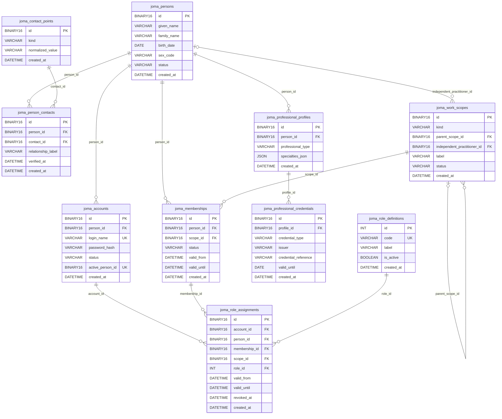
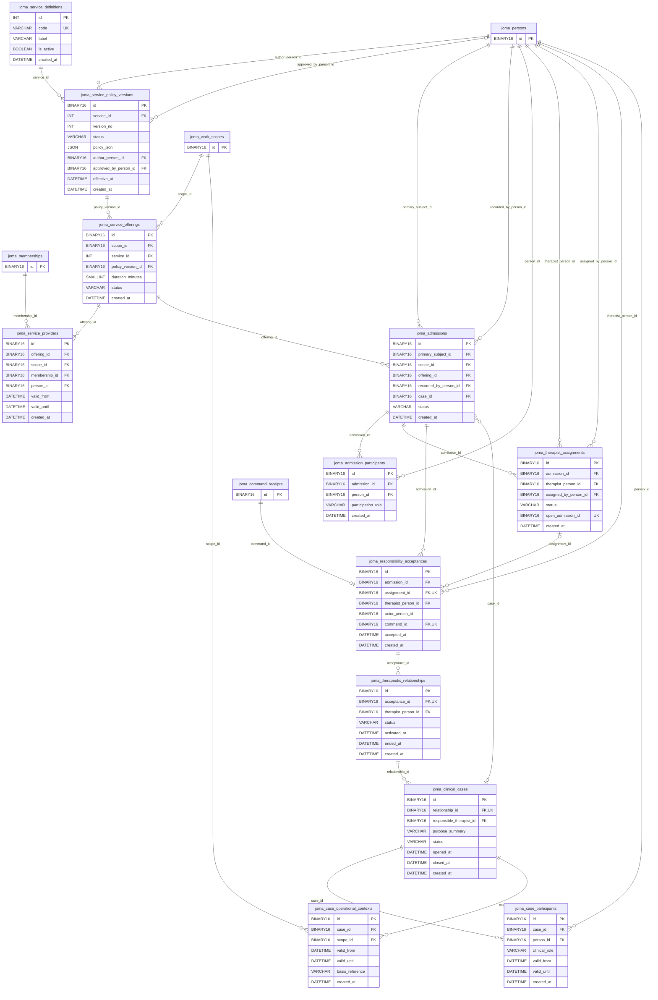
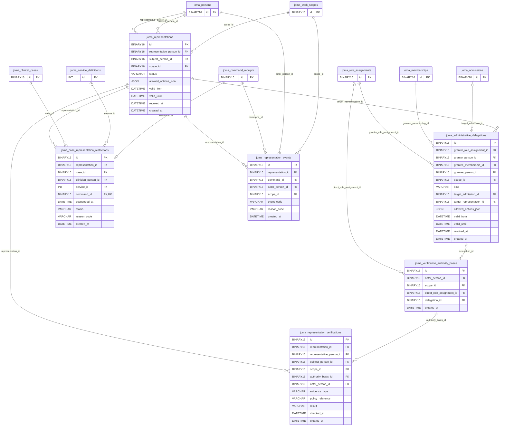
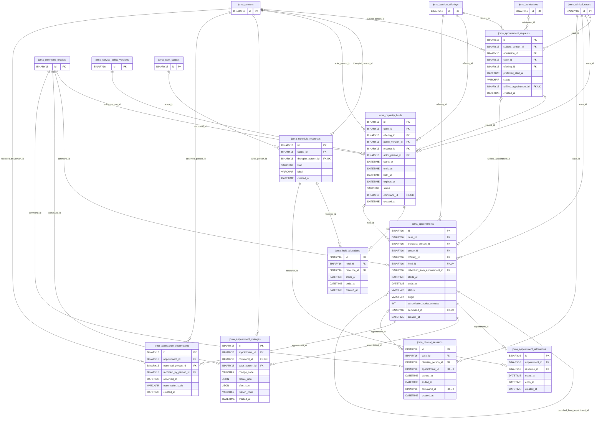
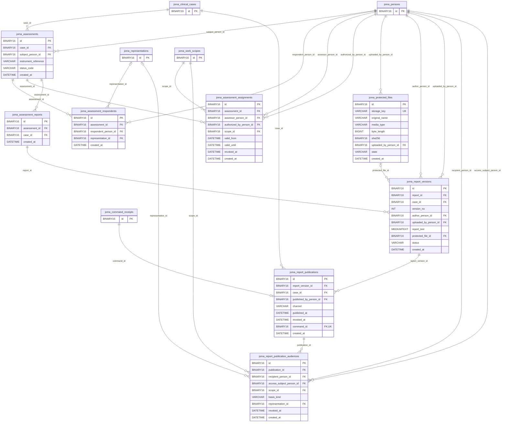
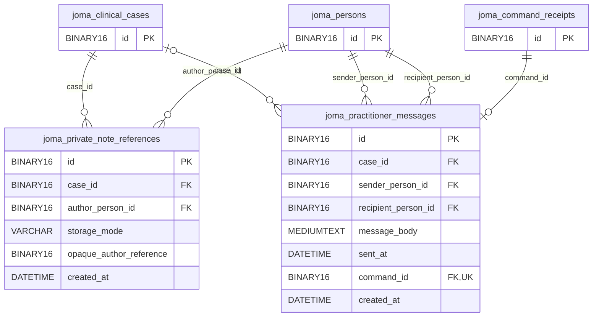
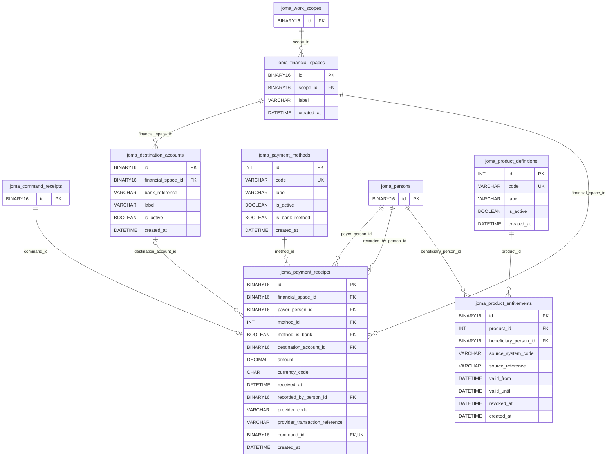
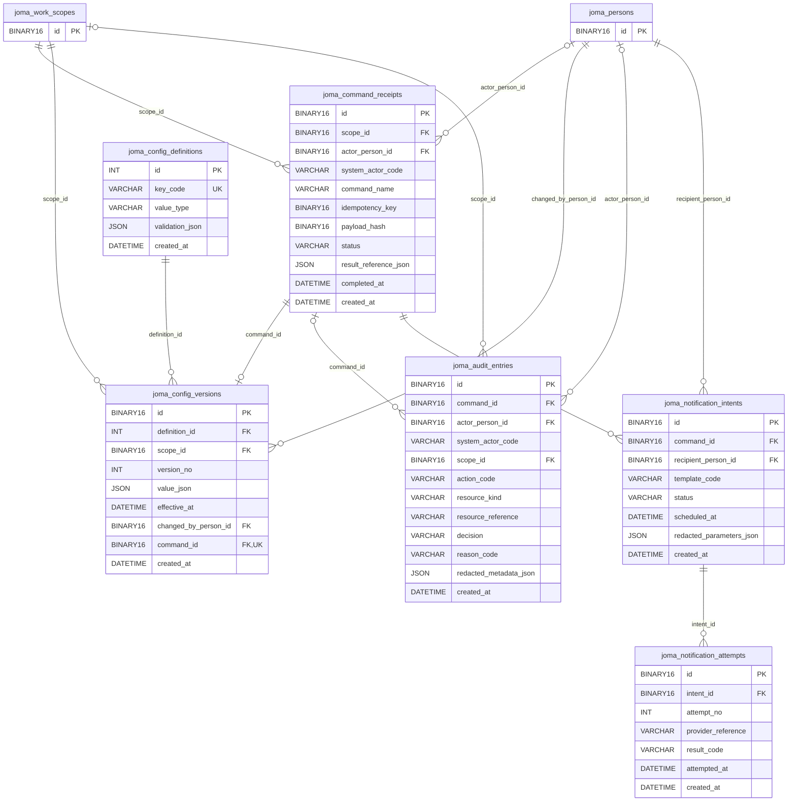

# جوما — Physical ERD v0.1

این نمودارها از همان منبع DDL تولید شده‌اند؛ سند اصلی توضیحات: JOMA-PHYSICAL-SCHEMA-v0.1-FA.md.
نوع‌های Mermaid خلاصه‌اند؛ طول دقیق، UNSIGNED، collation، generated column و CHECKها در 001_core.sql مرجع قطعی‌اند.
جدول بیرونی در هر نما فقط با id نشان داده می‌شود. UNIQUE مرکب و شروط مجوز از خطوط نمودار به‌تنهایی قابل استنباط نیستند.
این طرح مرورپذیر است، نه گزارش اجرای موفق روی MySQL یا تضمین امنیت.

## هویت و نقش

## خدمات و پرونده

## نمایندگی و اختیار

## نوبت و جلسه

## فرم و مخاطب پاسخ

```mermaid
erDiagram
    joma_admissions {
        BINARY16 id PK
    }
    joma_appointments {
        BINARY16 id PK
    }
    joma_clinical_cases {
        BINARY16 id PK
    }
    joma_command_receipts {
        BINARY16 id PK
    }
    joma_consent_evidence {
        BINARY16 id PK
        BINARY16 submission_revision_id FK
        BINARY16 subject_person_id FK
        BINARY16 consenting_person_id FK
        BINARY16 representation_id FK
        BINARY16 statement_hash
        DATETIME accepted_at
        DATETIME created_at
    }
    joma_form_approvals {
        BINARY16 id PK
        BINARY16 form_version_id FK
        BINARY16 approver_person_id FK
        BINARY16 role_assignment_id FK
        BINARY16 scope_id FK
        BINARY16 definition_hash
        VARCHAR decision
        DATETIME reviewed_at
        DATETIME created_at
    }
    joma_form_instances {
        BINARY16 id PK
        BINARY16 form_version_id FK
        BINARY16 scope_id FK
        BINARY16 admission_id FK
        BINARY16 case_id FK
        BINARY16 appointment_id FK
        BINARY16 designated_respondent_id FK
        VARCHAR status
        DATETIME created_at
    }
    joma_form_publication_audiences {
        BINARY16 id PK
        BINARY16 publication_id FK
        BINARY16 recipient_person_id FK
        BINARY16 access_subject_person_id FK
        BINARY16 scope_id FK
        VARCHAR basis_kind
        BINARY16 representation_id FK
        DATETIME revoked_at
        DATETIME created_at
    }
    joma_form_publications {
        BINARY16 id PK
        BINARY16 submission_revision_id FK
        BINARY16 instance_id FK
        BINARY16 case_id FK
        BINARY16 published_by_person_id FK
        DATETIME published_at
        DATETIME revoked_at
        BINARY16 command_id FK, UK
        DATETIME created_at
    }
    joma_form_subjects {
        BINARY16 id PK
        BINARY16 instance_id FK
        BINARY16 subject_person_id FK
        DATETIME created_at
    }
    joma_form_submission_revisions {
        BINARY16 id PK
        BINARY16 instance_id FK
        INT revision_no
        BINARY16 respondent_person_id FK
        BINARY16 recorded_by_person_id FK
        BINARY16 representation_id FK
        JSON answers_json
        VARCHAR state
        DATETIME submitted_at
        BINARY16 command_id FK, UK
        DATETIME created_at
    }
    joma_form_templates {
        BINARY16 id PK
        BINARY16 scope_id FK
        VARCHAR label
        VARCHAR form_kind
        DATETIME created_at
    }
    joma_form_versions {
        BINARY16 id PK
        BINARY16 template_id FK
        INT version_no
        JSON schema_json
        VARCHAR status
        BINARY16 author_person_id FK
        DATETIME published_at
        DATETIME created_at
    }
    joma_persons {
        BINARY16 id PK
    }
    joma_representations {
        BINARY16 id PK
    }
    joma_role_assignments {
        BINARY16 id PK
    }
    joma_service_form_requirements {
        BINARY16 id PK
        BINARY16 policy_version_id FK
        BINARY16 form_version_id FK
        VARCHAR stage_code
        VARCHAR respondent_role_code
        BOOLEAN is_required
        DATETIME created_at
    }
    joma_service_policy_versions {
        BINARY16 id PK
    }
    joma_service_prerequisites {
        BINARY16 id PK
        BINARY16 policy_version_id FK
        VARCHAR action_code
        VARCHAR prerequisite_code
        JSON parameters_json
        DATETIME created_at
    }
    joma_work_scopes {
        BINARY16 id PK
    }
    joma_work_scopes ||--o{ joma_form_templates : scope_id
    joma_form_templates ||--o{ joma_form_versions : template_id
    joma_persons ||--o{ joma_form_versions : author_person_id
    joma_form_versions ||--o{ joma_form_approvals : form_version_id
    joma_role_assignments ||--o{ joma_form_approvals : role_assignment_id
    joma_service_policy_versions ||--o{ joma_service_form_requirements : policy_version_id
    joma_form_versions ||--o{ joma_service_form_requirements : form_version_id
    joma_service_policy_versions ||--o{ joma_service_prerequisites : policy_version_id
    joma_form_versions ||--o{ joma_form_instances : form_version_id
    joma_work_scopes ||--o{ joma_form_instances : scope_id
    joma_admissions o|--o{ joma_form_instances : admission_id
    joma_clinical_cases o|--o{ joma_form_instances : case_id
    joma_appointments o|--o{ joma_form_instances : appointment_id
    joma_persons o|--o{ joma_form_instances : designated_respondent_id
    joma_form_instances ||--o{ joma_form_subjects : instance_id
    joma_persons ||--o{ joma_form_subjects : subject_person_id
    joma_form_instances ||--o{ joma_form_submission_revisions : instance_id
    joma_persons ||--o{ joma_form_submission_revisions : respondent_person_id
    joma_persons ||--o{ joma_form_submission_revisions : recorded_by_person_id
    joma_representations o|--o{ joma_form_submission_revisions : representation_id
    joma_command_receipts ||--o| joma_form_submission_revisions : command_id
    joma_form_submission_revisions ||--o{ joma_consent_evidence : submission_revision_id
    joma_persons ||--o{ joma_consent_evidence : subject_person_id
    joma_persons ||--o{ joma_consent_evidence : consenting_person_id
    joma_representations o|--o{ joma_consent_evidence : representation_id
    joma_form_submission_revisions ||--o{ joma_form_publications : submission_revision_id
    joma_form_instances ||--o{ joma_form_publications : instance_id
    joma_persons ||--o{ joma_form_publications : published_by_person_id
    joma_command_receipts ||--o| joma_form_publications : command_id
    joma_form_publications ||--o{ joma_form_publication_audiences : publication_id
    joma_persons ||--o{ joma_form_publication_audiences : recipient_person_id
    joma_persons ||--o{ joma_form_publication_audiences : access_subject_person_id
    joma_work_scopes ||--o{ joma_form_publication_audiences : scope_id
    joma_representations o|--o{ joma_form_publication_audiences : representation_id
```

## ارزیابی و گزارش

## مرز خصوصی و پیام

## دریافت و استحقاق

## پیکربندی و ممیزی

